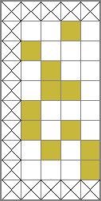

# Procedural Pixel Art Kata

## About this Kata

Difficulty: pre-intermediate
Useful for teaching: algorithm

The original theory for this Kata, as well as exemplary images was posted [here](https://github.com/yurkth/sprator#theory). 

## Problem Description

Your task is writing a program that generates colorful Pixel Art sprites using a cellular automaton (which is very simple).

### _(optional)_ What is a cellular automaton?

I explain what a cellular automaton by an example is. Let's have a two-dimensional array of numbers (3x3):
```
+---+---+---+
| 0 | 1 | 0 |
| 0 | 1 | 0 |
| 0 | 0 | 1 |
+---+---+---+
```
We call it **a grid** of **cells**! Each **cell** has a **state**. I represent a state by a number (but in general, you can use any data type!), so cells in my example have two possible states: `1` and `0`. I refer to them as _alive_ and _dead_. Additionally, each cell has **a neighborhood**, which can be defined in many ways. Still, it's typically a list of adjacent cells ([Moore](https://en.wikipedia.org/wiki/Moore_neighborhood) and [Von Neumann](https://en.wikipedia.org/wiki/Von_Neumann_neighborhood) neighborhoods are the most popular).

Each cellular automaton has a **ruleset**. A **rule** is a function that determines the next state of a cell in terms of the current state of cell and states of cells in its neighborhood. That's it! Your algorithm just iterates over all cells and creates a new **generation** by determining cells' next states according to a ruleset. An initial state of a cellular automaton (we call it `t = 0`) is selected by assigning (by hand or randomly) a state for each cell.

The ruleset in my example is very simple: _If a cell has at least two alive neightbors (according to the Moore neighborhood), it will be alive. Otherwise, it will be dead._
```
+---+---+---+   +---+---+---+   +---+---+---+
| 0 | 1 | 0 |   | 0 | 0 | 0 |   | 0 | 0 | 0 |
| 0 | 1 | 0 |   | 0 | 1 | 0 |   | 0 | 0 | 0 |
| 0 | 0 | 1 |   | 0 | 0 | 0 |   | 0 | 0 | 0 |
+---+---+---+   +---+---+---+   +---+---+---+
     t=0             t=1             t=2
```

In my example's second generation, the only alive cell is that one in the center. This is because the other ones didn't have enough alive friends. In the next time step, all cells are dead (you know why? right?). That's all, Folks! You have now all theory to complete the Kata!

### User Story 1

Let's assume that a cell has only two states: **live** and **dead**. Create **a 5x10 grid** and generate a random noise inside **the right-aligned 4x8 sub-grid** (left a one cell border, we'll use it later). _Still don't know what to do?_ See the below image, where white and yellow colors mean the dead and live states, respectively.



### User Story 2

Create _a function_ that changes the cell's states according to the following **ruleset**:
- Do not change border cells, but you can count them as dead.
- Any live cell with two or three neighbors survives (use the Moore neighborhood).
- Any dead cell with one or less live neighbors becomes a live cell.
- All other live cells die in the next generation. Similarly, all other dead cells stay dead.

**Run the function twice**. Check the below example to see how it works.


### User Story 3

Copy and flip grid to make a complete image (so the grid has a size of 10x10). Add an outline (just add a new cell state, I marked it as the brown color).


At this point, you have a fully functional pixel art generation process. As the last step (if you have time), you can do the optional User Story 4.

### _(optional)_ User Story 4

The last step is changing cell states into real (like RGB) colors and saving it as an actual image! 

## Clues

Keep it simple! Just create a set of single-responsible functions and use build-in data-types.

## Suggested Test Cases

- Does a random array has the right size?
- Are all border cells dead at the beginning?
- Does the function determine the next state correctly?
- Does the flip function do its job?
- Is the outline is ok?
